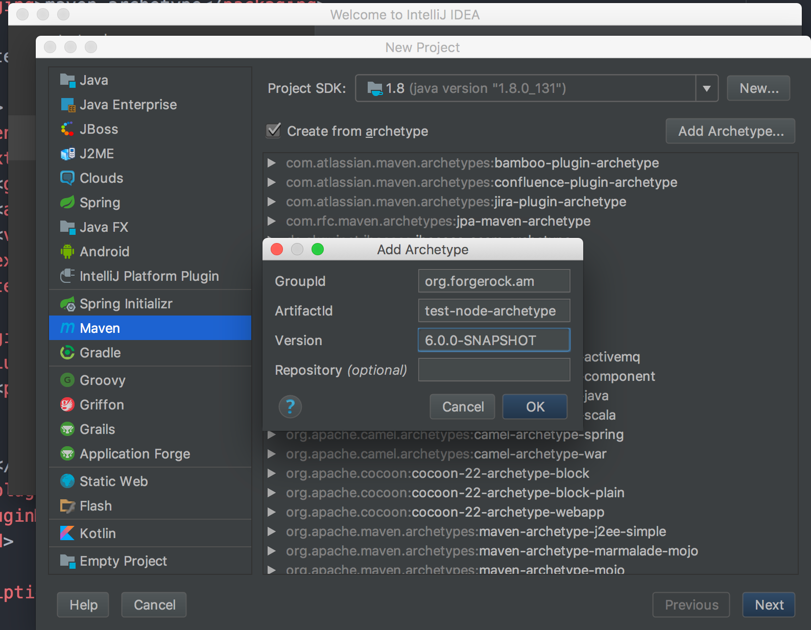

<b>ForgeRock AM authentication node archetype</b>
 
This is an archetype that will provide the skeleton of an authentication node.
To use this archetype:
1. Clone this project
2. Run "mvn clean install archetype:update-local-catalog". This will install
the archetype in your local archetype catalog (${HOME}/.m2/repository)
3. Use it! For example, if you are using intelliJ IDEA, create a new prject->
Maven-> click "Create from archetype"

Now you have the basics, and you only need to implement the specific logic you
want in your new authentication node. Enjoy!
